# 🎲 Aussie Lotto App

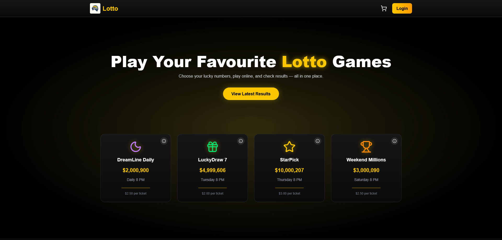

A full-stack **Next.js** lottery platform where users can play four different lotto games, buy tickets, view results, and manage their wallet — all fully automated with **cron-based scheduled draws**.

### 🎯 [Live Demo](https://lotto-app-mu.vercel.app)

---

## 🚀 Overview

This app simulates a complete online lotto experience:

- 4 active games (Daily Draw, LuckyDraw 7, StarPick and Weekend Millions)
- All games are drawn automatically at **8 PM**, on specific days depending on the game frequency
- Real-time jackpot rollover and prize division logic
- Clean UI for tickets, transactions, results, and account management

---

## 🗂 Project Structure

<details>
<summary>📂 <strong>File Tree: scheduler</strong></summary>

```text
├── 📁 helpers
│   ├── 📄 calculatePrizes.ts
│   └── 📄 updateJackpot.ts
├── 📄 ensureNextDrawExits.ts
├── 📄 getNextDrawDate.ts
├── 📄 index.ts
├── ⚙️ package-lock.json
├── ⚙️ package.json
├── 📄 runDueDrawsForGame.ts
├── 📄 runOnce.ts
├── 📄 scheduleAllGames.ts
├── ⚙️ tsconfig.json
└── 📄 types.ts
```

</details>

<details>
<summary>📁 <strong>File Tree: src</strong></summary>

```text
├── 📁 app
│ ├── 📁 api
│ │ ├── 📁 account
│ │ │ └── 📄 route.ts
│ │ ├── 📁 auth
│ │ │ └── 📁 [...nextauth]
│ │ │ └── 📄 route.ts
│ │ ├── 📁 draws
│ │ │ └── 📁 latest
│ │ │ └── 📄 route.ts
│ │ ├── 📁 games
│ │ │ ├── 📁 [slug]
│ │ │ │ ├── 📁 completed
│ │ │ │ │ └── 📄 route.ts
│ │ │ │ └── 📄 route.ts
│ │ │ └── 📄 route.ts
│ │ ├── 📁 register
│ │ │ └── 📄 route.ts
│ │ ├── 📁 tickets
│ │ │ ├── 📁 draw
│ │ │ │ └── 📁 [drawId]
│ │ │ │ └── 📄 route.ts
│ │ │ ├── 📁 user
│ │ │ │ └── 📄 route.ts
│ │ │ └── 📄 route.ts
│ │ └── 📁 transactions
│ │ └── 📁 user
│ │ └── 📄 route.ts
│ ├── 📁 cart
│ │ ├── 📁 components
│ │ │ ├── 📄 AddCreditsModal.tsx
│ │ │ ├── 📄 CartFooter.tsx
│ │ │ ├── 📄 CartHeader.tsx
│ │ │ └── 📄 TicketAccordion.tsx
│ │ └── 📄 page.tsx
│ ├── 📁 game
│ │ └── 📁 [slug]
│ │ ├── 📁 components
│ │ │ ├── 📁 create-your-own
│ │ │ │ ├── 📄 GameAccordion.tsx
│ │ │ │ ├── 📄 ManualPicker.tsx
│ │ │ │ ├── 📄 PickerFooter.tsx
│ │ │ │ └── 📄 PickerSetup.tsx
│ │ │ ├── 📄 GameHeader.tsx
│ │ │ └── 📄 PlayOptions.tsx
│ │ └── 📄 page.tsx
│ ├── 📁 login
│ │ └── 📄 page.tsx
│ ├── 📁 register
│ │ └── 📄 page.tsx
│ ├── 📁 results
│ │ ├── 📁 [slug]
│ │ │ └── 📄 page.tsx
│ │ └── 📄 page.tsx
│ ├── 📁 settings
│ │ ├── 📁 components
│ │ │ ├── 📄 AddCreditsCard.tsx
│ │ │ ├── 📄 ChangePasswordCard.tsx
│ │ │ ├── 📄 DeleteAccountCard.tsx
│ │ │ └── 📄 EditEmailCard.tsx
│ │ └── 📄 page.tsx
│ ├── 📁 tickets
│ │ ├── 📁 components
│ │ │ ├── 📄 EmptyState.tsx
│ │ │ ├── 📄 MonthSelector.tsx
│ │ │ ├── 📄 TicketAccordion.tsx
│ │ │ └── 📄 TicketList.tsx
│ │ └── 📄 page.tsx
│ ├── 📁 transactions
│ │ ├── 📁 components
│ │ │ └── 📄 TransactionList.tsx
│ │ └── 📄 page.tsx
│ ├── 🎨 globals.css
│ ├── 📄 layout.tsx
│ ├── 📄 page.tsx
│ └── 📄 providers.tsx
├── 📁 components
│ ├── 📄 AuthLayout.tsx
│ ├── 📄 GameCard.tsx
│ ├── 📄 Modal.tsx
│ ├── 📄 Navbar.tsx
│ ├── 📄 Skeleton.tsx
│ ├── 📄 Spinner.tsx
│ └── 📄 Toaster.tsx
├── 📁 lib
│ ├── 📄 authOptions.ts
│ ├── 📄 axios.ts
│ ├── 📄 prisma.ts
│ └── 📄 utils.ts
├── 📁 redux
│ ├── 📁 api
│ │ ├── 📄 accountApi.ts
│ │ ├── 📄 baseApi.ts
│ │ └── 📄 gameApi.ts
│ ├── 📁 slices
│ │ ├── 📄 accountSlice.ts
│ │ ├── 📄 authSlice.ts
│ │ ├── 📄 cartSlice.ts
│ │ └── 📄 ticketSlice.ts
│ └── 📄 store.ts
├── 📁 types
│ ├── 📄 game.ts
│ ├── 📄 next-auth.d.ts
│ ├── 📄 ticket.ts
│ └── 📄 transaction.ts
├── 📁 utils
│ ├── 📄 formatDate.ts
│ ├── 📄 generateNumbers.ts
│ ├── 📄 getCronExpression.ts
│ ├── 📄 getGameColor.ts
│ ├── 📄 getNextDrawDates.ts
│ ├── 📄 groupTicketsByMonth.ts
│ ├── 📄 hasDrawTimePassed.ts
│ └── 📄 sendWinEmail.ts
└── 📄 middleware.ts
```

</details>

---

## 🖼️ Screenshots

### 🎮 Play a Game

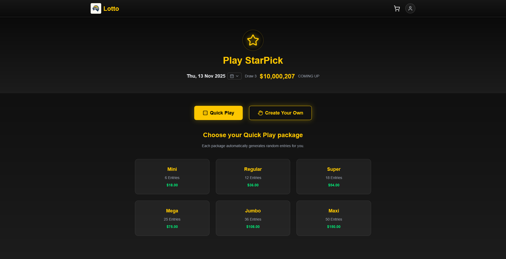  
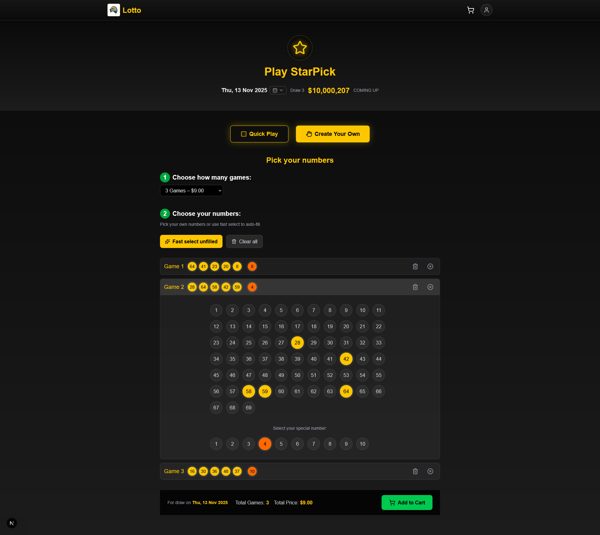

### 🎟️ My Tickets

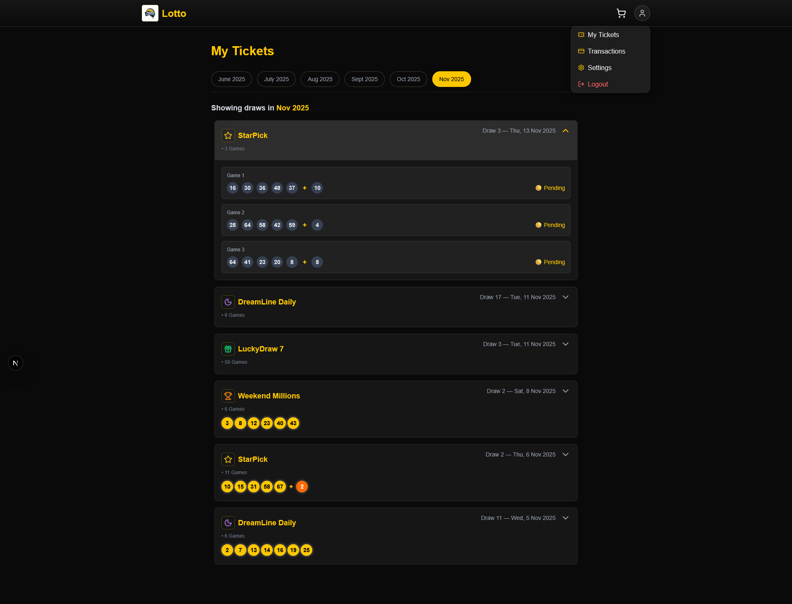

### 🗓️ Next Draws

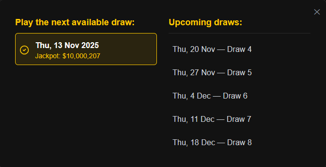

### 🏆 Results

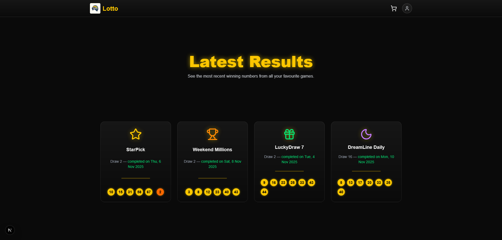

### 📊 Game Results

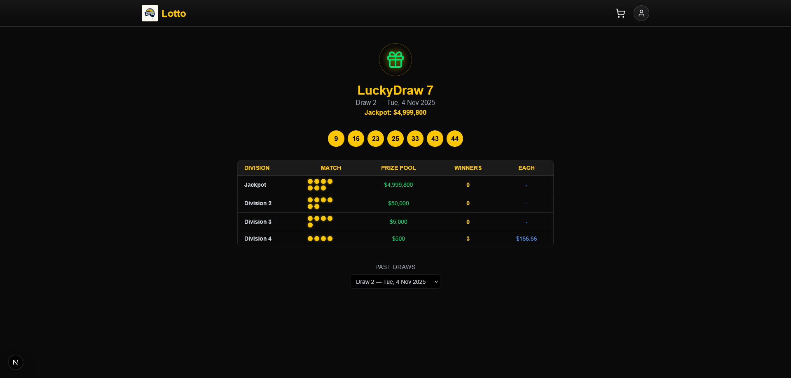

### 💳 Transactions

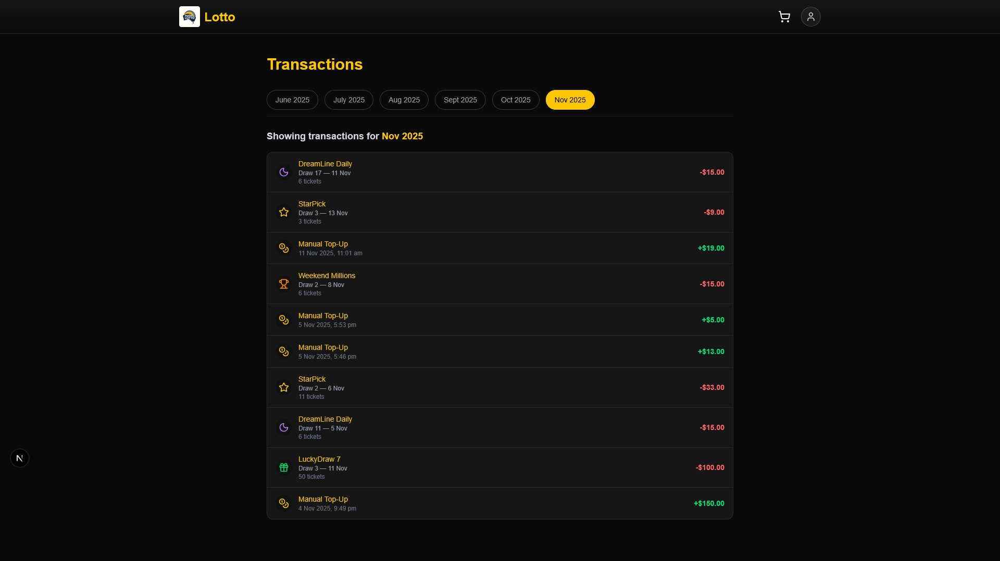

### 🛒 Cart

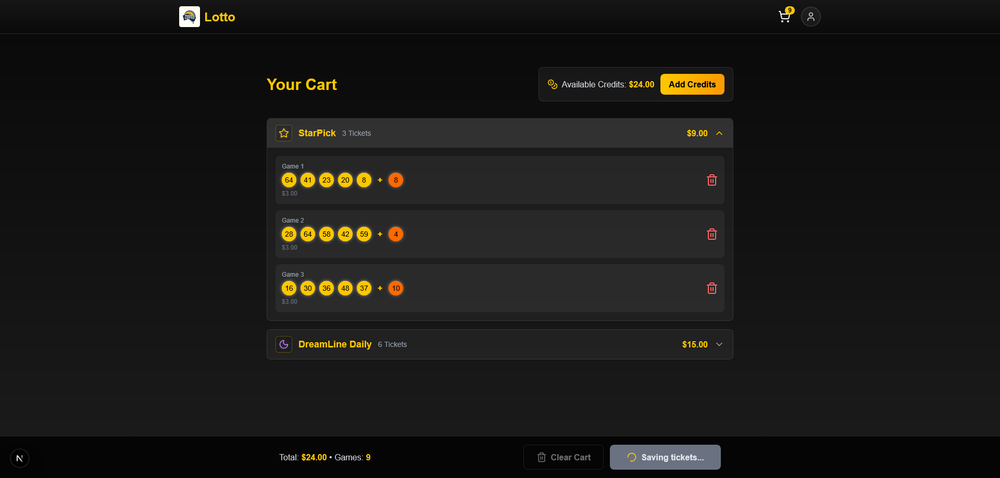

### 👤 Account

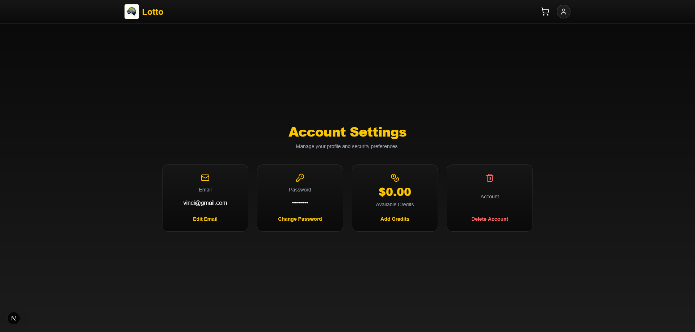

### 🔐 Login

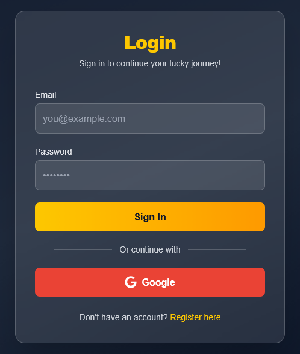

---

## 🧠 How It Works

### 🎯 Scheduler

- Uses a **Node cron-based scheduler** (`node-cron` + Prisma)
- Each game’s next draw is calculated using `getNextDrawDate()` and `getCronExpression()`
- All draws run at **8 PM Brisbane Time**, automatically:
  - Daily Draw → Every day 8 PM
  - LuckyDraw 7 → Tuesday 8 PM
  - StarPick → Thursday 8 PM
  - Weekend Millions → Saturday 8 PM
- The `scheduleAllGames.ts` script sets up cron jobs per game
- `runDueDrawsForGame.ts` handles generating winning numbers, calculating prize divisions, and updating jackpots

If there are no winners in a division, the **jackpot rolls over** and grows proportionally with ticket sales.

---

## 💰 Prize Logic

- Division prizes are automatically **split among winners**
- Fixed prizes for lower divisions
- Jackpot rolls over and increases with every draw without a winner
- Realistic draw engine with dynamically growing jackpots

---

## 🧾 Key Features

### 🎟️ Ticket Management

- “Quick Play” or “Create Your Own Numbers”
- Tickets grouped by draw and month
- Results show winning numbers and prize breakdowns per division

### 💼 Wallet & Transactions

- Add credits via **Add Credits modal**
- Secure top-ups powered by **Stripe Checkout** — users can safely add credits using card payments
- Wallet updates instantly after each purchase or payout
- Transaction history available under “Transactions”

### 👤 Account Dashboard

- Edit email and password
- Add or withdraw credits
- Delete account (only if no credits left)
- Login via **email/password** or **Google OAuth**

### 🗓️ Results

- View latest results per game
- Game results automatically update after every draw
- Historical results available per draw

---

## 🧩 Tech Stack

| Layer             | Technology                                                                          |
| ----------------- | ----------------------------------------------------------------------------------- |
| Frontend          | **Next.js 15**, **TypeScript**, **TailwindCSS**, **Redux Toolkit**, **NextAuth.js** |
| Backend           | **Prisma ORM**, **PostgreSQL**, **Next.js API Routes**                              |
| Scheduler         | **Node-cron**, **TypeScript**, **Prisma Client**                                    |
| Hosting           | **Vercel** (Frontend + Backend)                                                     |
| Scheduler Service | GitHub Actions / Node runtime with cron triggers                                    |

---
